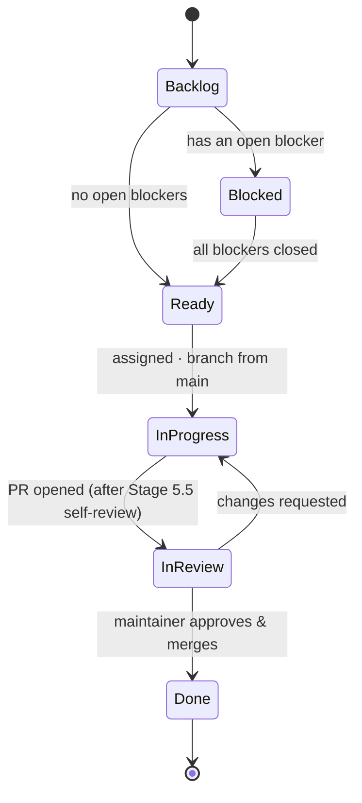
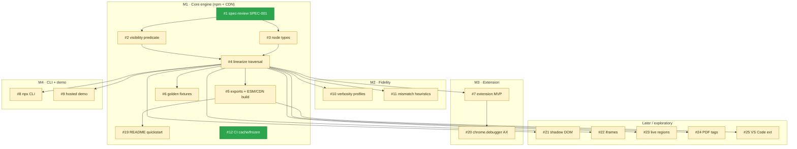

# Project Board — process, state, and dependencies

The canonical map of **how work flows** and **what unlocks what**. This is the version-controlled
companion to the live [GitHub Project board #4](https://github.com/users/Koshux/projects/4), the
[Milestones](https://github.com/Koshux/screen-reader-mirror/milestones), and the pinnable
[📍 Roadmap & dependency overview issue (#26)](https://github.com/Koshux/screen-reader-mirror/issues/26).

The narrative roadmap is in [roadmap.md](roadmap.md); the task detail is in [tasks.md](tasks.md);
the process rules are in [../sdlc/README.md](../sdlc/README.md).

---

## Board columns

```
Backlog → Todo (Ready) → In progress → In review (PR open) → Done
```

A ticket is **Ready** only when every ticket it is *blocked by* is closed. Blocked tickets carry
the `blocked` label and a **Blocked by:** line in their body; filter the board/issues by
`-label:blocked` to see what is actually actionable.

> **Ready to start right now:** **#1** (Stage 2.5 spec-review of SPEC-001) and **#12** (CI cache /
> frozen install). Everything else is `blocked` until its prerequisites close.

---

## Ticket lifecycle — the process every ticket follows



Contributors cannot self-merge — the `InReview → Done` transition is the maintainer's
(branch protection + CODEOWNERS). Spec-backed work also passes the SDLC gates **before**
`InProgress`: Journey → Spec → **Stage 2.5 spec-review**. See [../sdlc/README.md](../sdlc/README.md).

---

## Dependency graph — what unlocks what

Arrows point from a prerequisite to the ticket it unblocks. 🟢 ready now · 🟡 blocked.



The **critical path** to the first release is `#1 → (#2, #3) → #4 → #5 → #19 → publish`. `#12` is
independent and can run in parallel from day one.

---

## Ticket index (T-id ↔ issue ↔ milestone ↔ blocked by)

| Issue | T-id | Title | Milestone | Blocked by | State |
|---|---|---|---|---|---|
| [#1](https://github.com/Koshux/screen-reader-mirror/issues/1) | T1 | Stage 2.5 spec-review of SPEC-001 | M1 | — | 🟢 ready |
| [#2](https://github.com/Koshux/screen-reader-mirror/issues/2) | T2 | core: AT-visibility predicate | M1 | #1 | 🟡 blocked |
| [#3](https://github.com/Koshux/screen-reader-mirror/issues/3) | T3 | core: InterpretationNode types | M1 | #1 | 🟡 blocked |
| [#4](https://github.com/Koshux/screen-reader-mirror/issues/4) | T4 | core: linearize() traversal | M1 | #2, #3 | 🟡 blocked |
| [#5](https://github.com/Koshux/screen-reader-mirror/issues/5) | T5 | core: exports + ESM/CDN build | M1 | #4 | 🟡 blocked |
| [#6](https://github.com/Koshux/screen-reader-mirror/issues/6) | T6 | core: golden fixtures | M1 | #4 | 🟡 blocked |
| [#19](https://github.com/Koshux/screen-reader-mirror/issues/19) | T8 | README quickstart verified | M1 | #5 | 🟡 blocked |
| [#12](https://github.com/Koshux/screen-reader-mirror/issues/12) | T7 | infra: CI cache + frozen install | M1 | — | 🟢 ready |
| [#10](https://github.com/Koshux/screen-reader-mirror/issues/10) | T20 | a11y: verbosity profiles | M2 | #4 | 🟡 blocked |
| [#11](https://github.com/Koshux/screen-reader-mirror/issues/11) | T21 | a11y: mismatch heuristics | M2 | #4 | 🟡 blocked |
| [#7](https://github.com/Koshux/screen-reader-mirror/issues/7) | T30 | extension MVP (journey+spec+impl) | M3 | #4 | 🟡 blocked |
| [#20](https://github.com/Koshux/screen-reader-mirror/issues/20) | T31 | extension: chrome.debugger AX tree | M3 | #7 | 🟡 blocked |
| [#8](https://github.com/Koshux/screen-reader-mirror/issues/8) | T40 | npx CLI host (journey+spec+impl) | M4 | #4 | 🟡 blocked |
| [#9](https://github.com/Koshux/screen-reader-mirror/issues/9) | T41 | hosted demo (journey+spec+impl) | M4 | #4 | 🟡 blocked |
| [#21](https://github.com/Koshux/screen-reader-mirror/issues/21) | T50 | core: shadow DOM + slots | Later | #4 | 🟡 blocked |
| [#22](https://github.com/Koshux/screen-reader-mirror/issues/22) | T51 | core: cross-origin iframes | Later | #4 | 🟡 blocked |
| [#23](https://github.com/Koshux/screen-reader-mirror/issues/23) | T52 | core: live regions | Later | #4 | 🟡 blocked |
| [#24](https://github.com/Koshux/screen-reader-mirror/issues/24) | T53 | PDF tag-tree mode (pdf.js) | Later | #4 | 🟡 blocked |
| [#25](https://github.com/Koshux/screen-reader-mirror/issues/25) | T54 | VS Code extension | Later | #5 | 🟡 blocked |
| [#26](https://github.com/Koshux/screen-reader-mirror/issues/26) | — | 📍 Roadmap & dependency overview | — | — | pinned |

---

## How dependencies are represented (and why)

A ticket that needs another done first is blocked **three** ways so it is visible however you look:

1. **`blocked` label** — filter the board/issues by it (and `-label:blocked` for the ready queue).
2. **A `Blocked by: #N` line in the issue body** — GitHub renders it as a live cross-reference, and
   the blocker shows the back-link in its timeline.
3. **This dependency graph** — the authoritative picture of the whole DAG.

> Optionally, mirror these into GitHub's native **issue dependencies** (issue ••• → "Mark as
> blocked by") for the built-in blocked indicator. The three mechanisms above are the source of
> truth and need no setup.

**Granularity is matched to leverage.** M1 (the active milestone) is split into fine-grained,
independently-shippable tickets. M2–M4 and Later are deliberately **one bundled ticket each**
(journey + spec + implement) because they are further out — each will be split into finer tickets
when it becomes the active milestone. For those bundled tickets, the *journey + spec* sub-work can
begin before the blocker closes; only the **implementation** is truly blocked.

---

## Suggested board view setup (one-time, in the GitHub UI)

The Project board ships with a default `Status` field (Todo / In Progress / Done). To mirror the
lifecycle above, add two `Status` options — **Blocked** and **In review** — and group the board by
`Status`. Add `Milestone` as a column to see the roadmap phase at a glance. (Field-option edits
aren't reliably scriptable, so this stays a quick manual step.)
